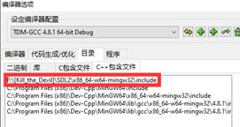

### AI Challenger

> 咸鱼鱼在高二的课余时间搓的小游戏/软件

#### 简介

本软件可以帮助使用者练习编写AI

利用SDL2实现的可视化窗口帮助使用者看到AI的具体操作

 

#### 使用说明

* 本软件使用C++和SDL2编写。

* 安装SDL2 (以dev c++为范例)
  1. 在压缩包目录下，找到SDL2.rar，在固定目录解压。
  2. 打开devc++，打开”工具=>编译选项=>目录”
  3. 在”二进制目录”, ”库”, ”C++包含文件”中，分别添加SDL2的对应目录
     * 举例
  4. 打开工程文件(AIChallenger.dev)下main.cpp，既可以编译运行。

* 了解软件

  1. **AIChallenger.exe**
     * 游戏本体
  2. **set_mode.bat**
     * 附带参数启动游戏
  3. Readme_set_mode.md
     * 说明参数意义
  4. Readme.md
     * 对游戏机制进行说明

  * 使用范例（了解游戏基本机制）
    1. 双击 AIChallenger.exe
    2. 根据说明进行操作
  * 使用范例2（了解AI运行效果）
    1. 右键set_mode.bat，点击编辑
    2. 将参数改为4 1 1 1，保存并关闭
    3. 双击set_mode.bat

* 操作方式

  * 角色1: W A S D 上下左右 J轻击 K重击；
  * 角色2: ↑↓←→上下左右 1轻击 2重击 (小键盘)；

* 游戏机制

  * 角色血量位于贴图右下角
  * 测试机器人有4波，分别有2,2,3,4个，一些测试机器人有较高智力
  * 弓箭手：血量为3，子弹上限为1（毕竟手上只能拿一只箭）
    * 轻击为射箭，1点伤害，消耗1点子弹，后摇1s；
    * 重击为飞踢，3点伤害，不消耗子弹，后摇2s；
  * 猎人：血量为2，子弹上限为2（双管猎枪）
    * 轻击射出一发子弹，1点伤害，后摇0.1s;
    * 重击射出独头弹(2发子弹)，4点伤害，后摇2s；

* 编写你的AI

  * 打开AI接口文档.doc，查看具体方法及范例

 

Made By. YXH_XianYu

QQ: 2943003
